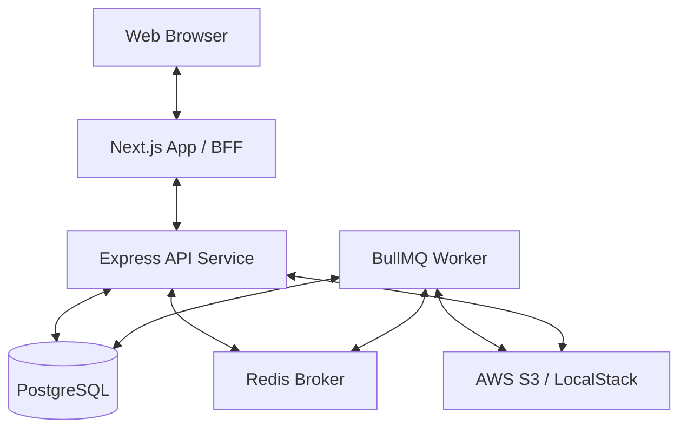

# Inventory Voucher System (Monorepo)

This project is a modern, enterprise-grade **Inventory Management System** designed for scalability, reliability, and ease of deployment. It utilizes a monorepo structure powered by **Turborepo** and is built on a high-performance technology stack including Next.js, Express, BullMQ, and PostgreSQL.

---

## 🏗 System Architecture

The application follows a distributed architecture to ensure high availability and responsiveness.



### Components:
- **Frontend (`apps/frontend`)**: A high-performance **Next.js** application serving as both the direct UI and a **Backend-for-Frontend (BFF)**.
- **Backend (`apps/backend`)**: Core business logic service built with **Express**. Handles transactions, inventory rules, and API orchestrations.
- **Worker (`apps/worker`)**: Distributed task processor using **BullMQ**. Processes heavy workloads like large-scale Excel exports and imports asynchronously.
- **Shared Packages (`packages/*`)**:
    - `@repo/db`: Centralized database schema, Prisma-like repositories, and migration scripts.
    - `@repo/types`: Unified TypeScript definitions shared across all services.
    - `@repo/eslint-config`: Shared linting rules to maintain code quality.
    - `@repo/typescript-config`: Centralized TypeScript configurations.

---

## 🛠 Tech Stack

- **Frontend**: Next.js 14 (App Router), Tailwind CSS, TanStack Query, ShadcnUI.
- **Backend**: Node.js, Express, TypeScript, Zod (Validation).
- **Worker**: BullMQ.
- **Storage**: PostgreSQL (Primary DB), Redis (Queue/Cache), AWS S3 (File Storage).
- **Tooling**: Turborepo, Docker, ESLint, Prettier.

---

## 🚀 Getting Started

### Prerequisites
- **Node.js**: v20 or higher.
- **Docker**: For running database, redis, and S3 local services.
- **NPM**: Package manager.

### Local Development Setup

1.  **Clone the repository and install dependencies**:
    ```bash
    npm install
    ```

2.  **Environment Configuration**:
    Copy the example environment file and fill in the required secrets:
    ```bash
    cp .env.example .env
    ```
    > [!IMPORTANT]
    > Ensure `DB_PASSWORD`, `REDIS_PASSWORD`, and `AWS/S3` credentials are correctly configured.

3.  **Start Infrastructure**:
    Using Docker Compose to spin up necessary services:
    ```bash
    docker compose up -d postgres redis localstack
    ```

4.  **Run Development Environment**:
    ```bash
    npm run dev
    ```
    This starts all applications concurrently using Turborepo.
    - Frontend: `http://localhost:3000`
    - Backend: `http://localhost:4000`

---

## 💾 Database & Migrations

Database operations are centralized in `packages/db`.

- **Run Migrations**: `npm run migrate:up` (Runs automatically in Docker).
- **Seed Data**: To test with large datasets (e.g., 1 million vouchers):
    ```bash
    # Via Docker
    docker compose run --rm backend npm run seed:1m
    ```

---

## 📦 Production Deployment

### Dockerized Setup
The project is optimized for containerized environments. To build and start the full production stack:

```bash
docker compose up --build -d
```

### Key Production Features:
- **Health Checks**: Comprehensive health monitoring for all services.
- **Resource Limits**: Configured to prevent memory leaks and CPU exhaustion.
- **Log Rotation**: Automated log management to preserve disk space.
- **Network Security**: Database and Redis are isolated from the public internet.

---

## 🧪 Testing & Quality Assurance

We maintain high standards through rigorous testing and linting.

```bash
# Run all tests
npm run test

# Linting & Type Checking
npm run lint
npm run check-types
```

---

## 🔒 Security Best Practices
- **Environment Isolation**: Production secrets are never committed to the repository.
- **Input Validation**: Strict schema validation using Zod on all API boundaries.
- **Graceful Shutdown**: Services handle `SIGTERM` and `SIGINT` to close connections safely.

---

## 📄 License
Internal proprietary project. All rights reserved.
