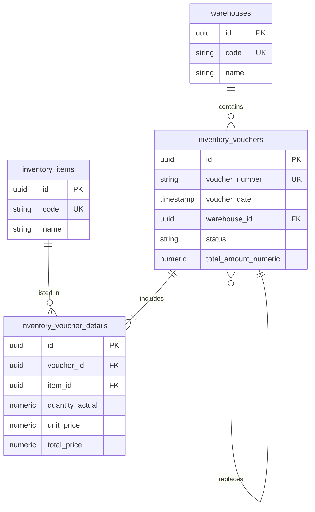

# Backend Service - Inventory Voucher Management System

This is the core backend service for the inventory management system, built with **Express** and **TypeScript**. It is responsible for handling business logic, inventory transactions, and providing APIs for the frontend.

---

## 💾 Database Schema

The system uses **PostgreSQL** for data storage. Below are the details of the primary tables.

### 1. `warehouses` Table
Stores information about warehouses in the system.

| Column | Data Type | Description |
| :--- | :--- | :--- |
| `id` | `UUID` | Primary Key (Default: `gen_random_uuid()`) |
| `code` | `VARCHAR(50)` | Warehouse Code (Unique, Required) |
| `name` | `VARCHAR(255)` | Warehouse Name (Required) |
| `address` | `TEXT` | Warehouse Address |
| `is_active` | `BOOLEAN` | Active Status (Default: `true`) |
| `created_at` | `TIMESTAMPTZ` | Creation Time (Default: `now()`) |

### 2. `inventory_items` Table
Stores the catalog of materials and products.

| Column | Data Type | Description |
| :--- | :--- | :--- |
| `id` | `UUID` | Primary Key (Default: `gen_random_uuid()`) |
| `code` | `VARCHAR(50)` | Item Code (Unique, Required) |
| `name` | `VARCHAR(255)` | Item Name (Required) |
| `unit_name` | `VARCHAR(50)` | Measurement Unit |
| `description` | `TEXT` | Detailed Description |
| `created_at` | `TIMESTAMPTZ` | Creation Time (Default: `now()`) |

### 3. `inventory_vouchers` Table
Stores general information for inventory vouchers (receipts/issues).

| Column | Data Type | Description |
| :--- | :--- | :--- |
| `id` | `UUID` | Primary Key |
| `voucher_number` | `VARCHAR(50)` | Voucher Number (Unique, Required) |
| `voucher_date` | `TIMESTAMPTZ` | Voucher Issue Date (Required) |
| `status` | `VARCHAR(50)` | Status (`draft`, `posted`, `cancelled`) |
| `unit_name` | `VARCHAR(255)` | Organization Unit Name |
| `department_name` | `VARCHAR(255)` | Department Name |
| `debit_account` | `VARCHAR(20)` | Debit Account |
| `credit_account` | `VARCHAR(20)` | Credit Account |
| `deliverer_name` | `VARCHAR(255)` | Deliverer/Receiver Name |
| `warehouse_id` | `UUID` | Foreign Key referencing `warehouses.id` |
| `total_amount_numeric`| `NUMERIC(19,4)` | Total Amount (Default: 0, non-negative) |
| `total_amount_words` | `TEXT` | Total Amount in Words |
| `replaced_from_id` | `UUID` | Reference to previous voucher (for replacements) |
| `created_by` | `UUID` | ID of the creator |
| `created_at` | `TIMESTAMPTZ` | Creation Time |
| `updated_at` | `TIMESTAMPTZ` | Last Update Time |

### 4. `inventory_voucher_details` Table
Stores line items for each inventory voucher.

| Column | Data Type | Description |
| :--- | :--- | :--- |
| `id` | `UUID` | Primary Key |
| `voucher_id` | `UUID` | Foreign Key referencing `inventory_vouchers.id` (Cascade Delete) |
| `item_id` | `UUID` | Foreign Key referencing `inventory_items.id` |
| `item_code_snapshot` | `VARCHAR(50)` | Item Code (Snapshot at time of entry) |
| `item_name_snapshot` | `VARCHAR(255)` | Item Name (Snapshot at time of entry) |
| `quantity_by_doc` | `NUMERIC(19,4)` | Quantity according to documents (> 0) |
| `quantity_actual` | `NUMERIC(19,4)` | Actual quantity entered/issued (> 0) |
| `unit_price` | `NUMERIC(19,4)` | Unit Price (>= 0) |
| `total_price` | `NUMERIC(19,4)` | Total Price (Generated: `quantity_actual * unit_price`) |
| `sort_order` | `INTEGER` | Sorting order of lines |

---

## 🗺 Entity Relationship Diagram (ER Diagram)

---

## 🛠 Core Rules and Constraints

1.  **Uniqueness**: The `voucher_number` is unique across the entire system.
2.  **Quantity Constraints**: Actual quantity (`quantity_actual`) and document quantity (`quantity_by_doc`) must be greater than 0.
3.  **Data Integrity**: Deleting an inventory voucher (`inventory_vouchers`) automatically deletes all associated detail lines (`inventory_voucher_details`) via **Cascade Delete**.
4.  **Audit Trail**: Every voucher state change records the time (`updated_at`) and the user responsible.
5.  **Snapshot Mechanism**: Item code and name are stored directly in the details table at the time of entry (**Snapshot**) to preserve historical accuracy even if item metadata changes in the future.
